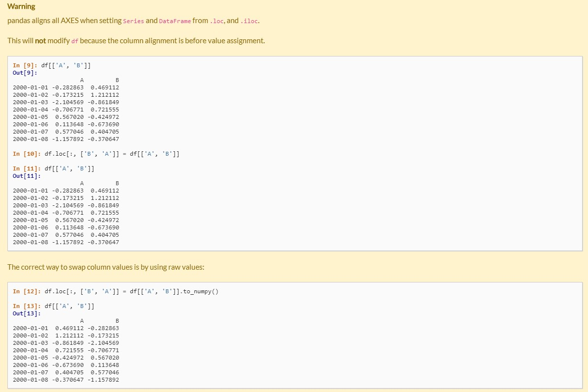

# Data Type

- Series : `s = pd.Series([1,3,5, np.nan, 6, 8])`
- DafaFrame 

# Construction
- `s = pd.Series([1,3,5, np.nan, 6, 8])`
- `dates = pd.date_range('20130101', period=6) # from 20130101 to 20130106`
- `df = pd.DataFrame(np.random.randn(6,4), index=dates, columns=list('ABCD'))`
- `df = pd.read_csv(xxxx)`


# Viewing data
- `df.head()`
- `df.tail(3)`
- `df.index`
- `df.columns`
- `df.to_numpy()`
  - when DataFrame with multiple dtypes, `to_numpy()` is relatively expensive
- `df.describe()` : show count, mean, std, min, 25%, 50%, 75%, max
- `df.T` : transpose
  
# Sorting
- `df.sort_index(axis=1, ascending=False)` sort by an axis, axis:{0:x-axis, 1:y-axis}
- `df.sort_values(by='B')`: sort by value
  
# Selection:
- While standard Python / Numpy expressions for selecting and setting are intuitive and come in handy for interactive work, for production code, we recommend the optimized pandas data access methods, `.at, .iat, .loc` and `.iloc`

## Getting
- `df['A']`: select one column,  resulting in an Series
- `df[0:3]`: slice the rows. Notice that `df[0]` is wrong. Selecting one rows is `df[0:1]`.
-  `df[['A','B']] = df[['B','A']]`
- 

## Access attribute
- `s.A`
- `df.B`
- `s.A = 5`
- `dfa.A = list(range(len(dfa.index)))  # ok if A already exists`
- `dfa['A'] = list(range(len(dfa.index)))  # use this form to create a new column`

## Slicing ranges
- `s[:5] = 0  # modify s[0:4] to 0`
- `df[::-1] # get reversed dataFrame`

## Select by label
- `df.loc`
- Series: `s.loc[indexer]`
- DataFrame: `df.loc[row_indexer,column_indexer]`
 
- `df.loc['20130102':'20130104']`  : use label to select items
  - For `loc`, the following are valid inputs:
  - A single label, e.g. 5 or 'a' (Note that 5 is interpreted as a label of the index. This use is not an integer position along the index.).
  - A list or array of labels ['a', 'b', 'c'].
  - A slice object with labels 'a':'f' (Note that contrary to usual python slices, *both the start and the stop* are included, when present in the index! See Slicing with labels.
    - slicing with label:
    - if labels are sorted: just like python slices, but start and stop are included.
    - if labels are not sorted : keep the order, but only select those rows in the slicing range ( why? really?) *the phenomenon is strange, warning when using this feature*
  - A boolean array. 
    - `df.loc['a'] > 0` generates a boolean array (a Series with dtype=bool)
    - `df.loc[ df.loc[:,'A']>0 ]` returns all rows where columns 'A' > 0
    - `df.loc[ boolean array ]` returns all rows where elemens in boolean array is `True` 
      - `len(boolean array)` should be equal to `(#row of df)` 
  - A callable, e.g. a lambda function (?)

- `df.loc['20130103','A']` ~~is a value~~ seems to be a Series with len = 1

## Select by position
- `df.iloc` start by 0, include lower bound, exclude upper bound
- `df.iloc[2:4, 2:5]` 
    - both row_indexer and column_indexer is standard python slicing
    - `df.iloc[1,:]` or `df.iloc[:,1]` returns a Series, while `df.iloc[1:2,:]` returns a DataFrame with len = 1
    - `df.iloc[1,1]` returns a float value


# Drop duplicates
- `Series.unique()` returns a numpy ndarray
- `DataFrame.drop_duplicates(subset=[xxx], keep={'first'/'last'/False}, inplace, ignore_index)`: subset - consider those columns, keep=False: drop all occurance


# To other data
## To JSON

- `df.to_json(oriend= {‘split’, ‘records’, ‘index’, ‘columns’, ‘values’, ‘table’})`

```PYTHON
>>> df = pd.DataFrame([['a', 'b'], ['c', 'd']],
                  index=['row 1', 'row 2'],
                  columns=['col 1', 'col 2'])
>>> df
      col 1 col 2
row 1     a     b
row 2     c     d

>>> df.to_json(orient='split')
'{"columns":["col 1","col 2"],
  "index":["row 1","row 2"],
  "data":[["a","b"],["c","d"]]}'
```

- Encoding/decoding a Dataframe using '**records**' formatted JSON. Note that index labels are not preserved with this encoding.
```PYTHON
>>> df.to_json(orient='records')
'[{"col 1":"a","col 2":"b"},{"col 1":"c","col 2":"d"}]'
```

- Encoding/decoding a Dataframe using '**index**' formatted JSON:
```PYTHON
>>> df.to_json(orient='index')
'{"row 1":{"col 1":"a","col 2":"b"},"row 2":{"col 1":"c","col 2":"d"}}'
```

- Encoding/decoding a Dataframe using '**columns**' formatted JSON:
```PYTHON
>>> df.to_json(orient='columns')
'{"col 1":{"row 1":"a","row 2":"c"},"col 2":{"row 1":"b","row 2":"d"}}'
```

- Encoding/decoding a Dataframe using '**values**' formatted JSON:
```PYTHON
>>> df.to_json(orient='values')
'[["a","b"],["c","d"]]'
```

## To Dict
`to_dict(self, orient='dict', into=<class 'dict'>)`
Convert the DataFrame to a dictionary.

orient:str {‘dict’, ‘list’, ‘series’, ‘split’, ‘records’, ‘index’}
Determines the type of the values of the dictionary.

- ‘dict’ (default) : dict like {column -> {index -> value}}
- ‘list’ : dict like {column -> [values]}
- ‘series’ : dict like {column -> Series(values)}
- ‘split’ : dict like {‘index’ -> [index], ‘columns’ -> [columns], ‘data’ -> [values]}
- ‘records’ : list like [{column -> value}, … , {column -> value}]
- ‘index’ : dict like {index -> {column -> value}}
